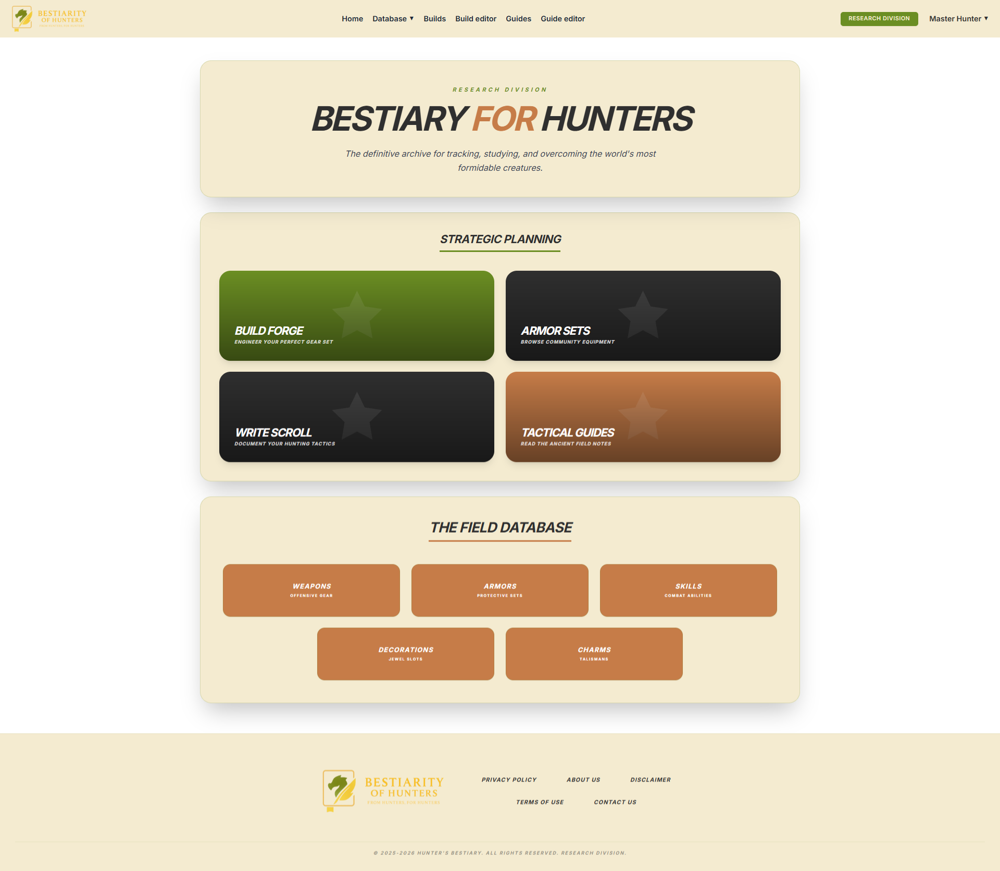
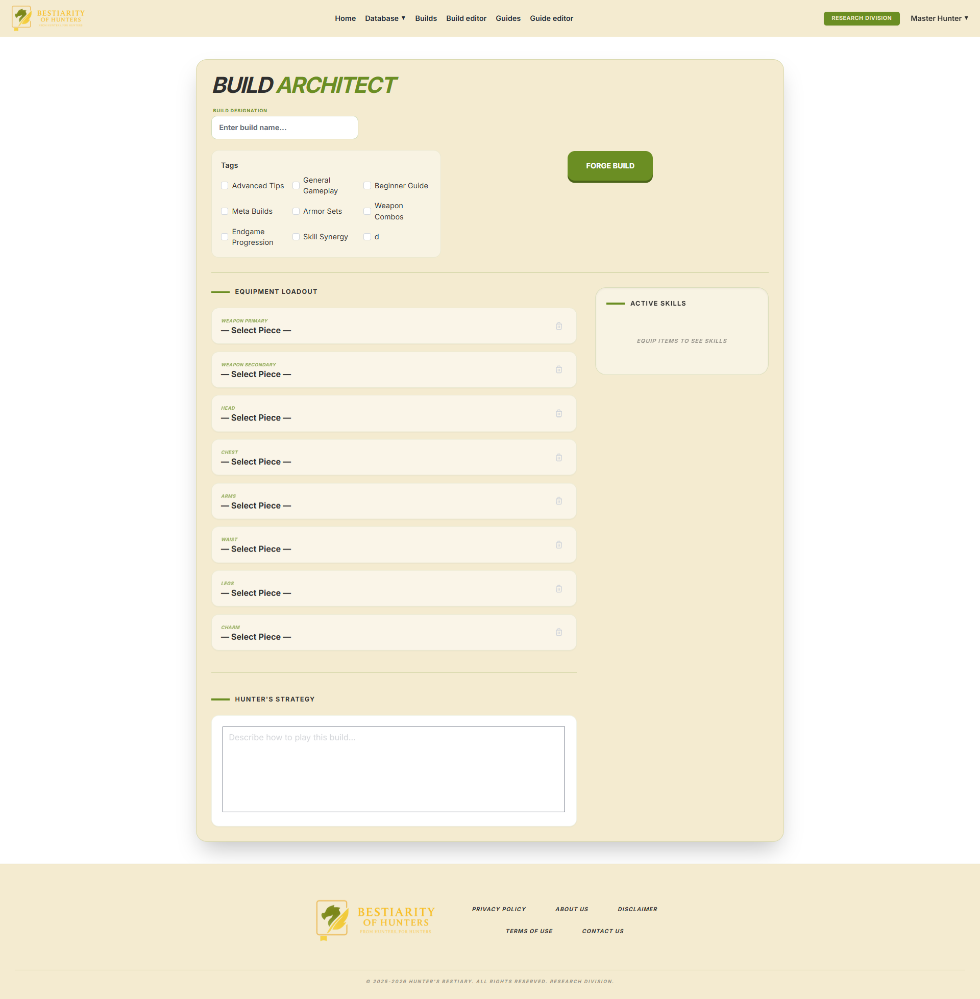
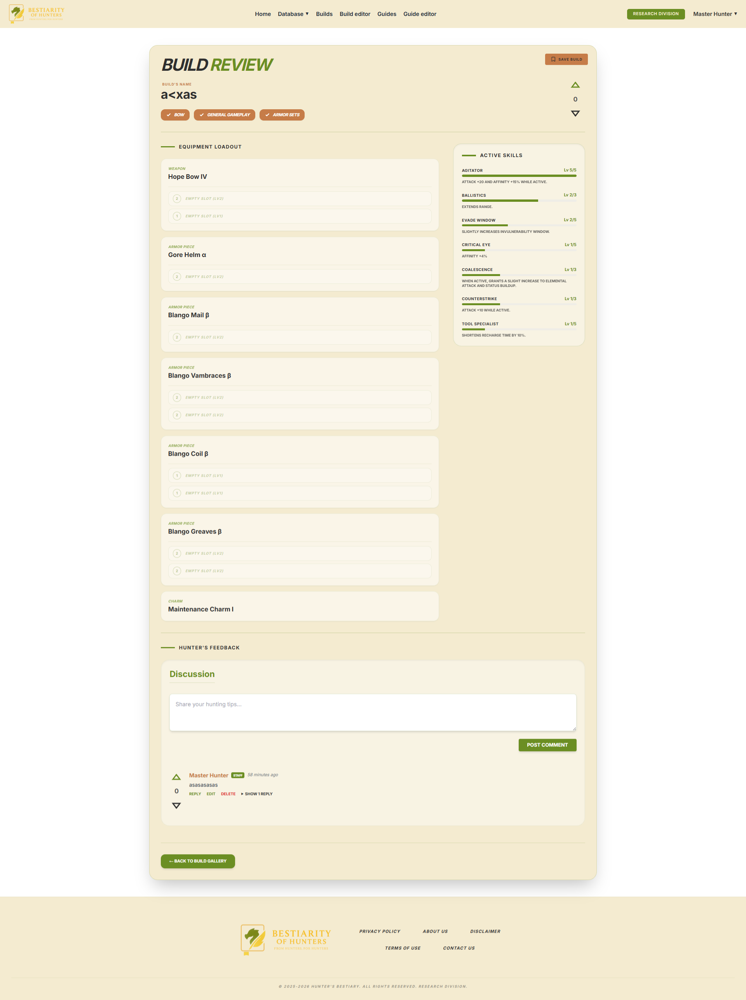
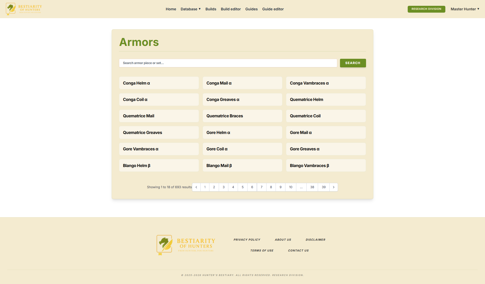
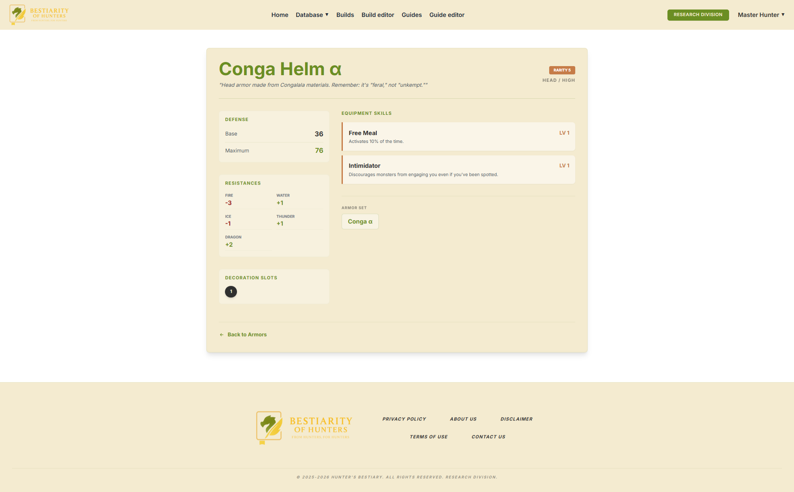

# Bestiarity of Hunters

## ¿Qué es el proyecto?

Bestiarity of Hunters es una plataforma web especializada para la comunidad de jugadores de Monster Hunter. Su objetivo principal es centralizar y facilitar la creación de builds que mejoren el rendimiento de un jugador en el juego, mientras comparte sus conocimientos y experiencias con otros jugadores.

A diferencia de un simple blog, la aplicación funciona como una herramienta interactiva donde el usuario puede:

- Utilizar un editor avanzado que calcula en tiempo real las habilidades resultantes de combinar diferentes piezas de armadura y decoraciones.
- Publicar guías detalladas y configuraciones con la comunidad.
- Sistema de feedback mediante votos y comentarios para destacar las mejores configuraciones de la temporada.

En definitiva, es un ecosistema de gestión de datos de juego transformado en una red social técnica para cazadores, eliminando la necesidad de usar hojas de cálculo externas y centralizando toda la información maestra del título en un solo lugar.

## Funcionalidades principales

### Gestión y Creación de Builds
- Editor avanzado: herramienta interactiva para la selección de armas, cinco piezas de armadura (cabeza, pecho, brazos, cintura y piernas) y amuletos.

- Gestión de decoraciones: sistema para insertar joyas en los huecos (slots) disponibles de cada equipo.

- Cálculo automático de skills: motor de lógica que suma y muestra el nivel de habilidades activas en tiempo real según la combinación elegida.

- Persistencia: guardado, edición y borrado de builds personalizadas vinculadas al perfil del usuario.

### Contenido Comunitario e Interacción
- Repositorio de guías: espacio para la publicación de guías estratégicas detalladas.

- Sistema de feedback: posibilidad de votar builds (positivo/negativo) y añadir comentarios para fomentar el debate técnico.

- Buscador y filtros: filtros dinámicos por etiquetas, tipos de arma o estilo de juego para localizar contenido específico rápidamente.

- Favoritos: Sistema de "Guardados" para que los usuarios puedan almacenar las builds y guías de otros cazadores en su perfil.

### Control y Administración
- Panel de control (Admin): interfaz exclusiva para la gestión de la plataforma.

- Moderación de usuarios: capacidad para gestionar roles y estados de las cuentas.

- Gestión de contenido: herramientas para editar o eliminar cualquier build, guía, comentario o etiqueta que infrinja las normas de la comunidad.

- Sistema de tags: creación y asignación de etiquetas personalizadas para categorizar el contenido.

## Tecnologías usadas

### Backend: Laravel 8 (PHP 7.4 / 8.0+)
Es el motor principal y el núcleo de la lógica de negocio.

Justificación: he elegido Laravel por su estructura sólida basada en el patrón MVC (Modelo-Vista-Controlador). Dado que el proyecto maneja datos complejos como piezas de armadura y cálculos de habilidades en tiempo real, el ORM Eloquent de Laravel facilita la gestión de relaciones en la base de datos. Además, el sistema de migraciones garantiza la consistencia de los datos en cualquier entorno.

### Frontend: Tailwind CSS 3.0
Framework encargado del diseño visual y la interfaz de usuario.

Justificación: al ser un framework de utilidades, permite crear una estética personalizada y de alta calidad sin escribir CSS desde cero. En un proyecto de Monster Hunter, donde la ambientación visual es clave, Tailwind facilita la aplicación de gradientes, layouts complejos y componentes responsivos de forma mantenible.

### Interactividad: JavaScript
Lenguaje de programación nativo para la lógica del lado del cliente.

Justificación: utilicé JavaScript puro para gestionar la interactividad de la interfaz, como la apertura de modales en el perfil de usuario o la manipulación dinámica del DOM en el editor de builds. Esto asegura un control total sobre el comportamiento de la página sin depender de librerías externas pesadas.

### Comunicación Dinámica: AJAX
Técnica de intercambio de datos asíncrono.

Justificación: fundamental para mejorar la experiencia de usuario. Se implementa mediante la API fetch de JavaScript para realizar búsquedas, aplicar filtros en las listas de builds y actualizar componentes del editor sin necesidad de recargar la página completa, permitiendo una navegación fluida y rápida.

### Autenticación y Perfiles: Laravel Breeze & Sanctum
Base del sistema de gestión de usuarios.

Justificación: Breeze proporciona un punto de partida limpio para el registro y login, integrándose de forma nativa con Tailwind. Por su parte, Sanctum asegura la autenticación mediante tokens de forma segura, permitiendo que la aplicación sea escalable para futuras integraciones o aplicaciones móviles.

### Base de Datos: MySQL / MariaDB
Sistema de gestión de base de datos relacional.

Justificación: es el estándar de fiabilidad para aplicaciones Laravel. Su capacidad para gestionar relaciones complejas es el pilar fundamental sobre el que se construye la lógica de Bestiarity of Hunters.

### Compilación de Assets: Laravel Mix (Webpack)
Herramienta de procesamiento de código CSS y JS.

Justificación: simplifica el uso de PostCSS y la compilación de Tailwind. Mix optimiza el rendimiento del sitio al minificar los archivos finales, asegurando que el navegador reciba recursos ligeros y el tiempo de carga sea mínimo.

## Instalación paso a paso

Para poner en marcha Bestiary of Hunters en un entorno local utilizando XAMPP, se deben seguir los siguientes pasos. Es fundamental contar con una versión de PHP 7.4 (o superior dentro de la rama 7) para asegurar la compatibilidad con Laravel 8.

### Paso 1: descarga del Proyecto
En lugar de usar comandos de consola, el proyecto se descarga directamente desde el repositorio de GitHub:

Acceder al repositorio en GitHub.

Hacer clic en el botón verde "Code" y seleccionar "Download ZIP".

Descomprimir el archivo obtenido dentro de la carpeta raíz del servidor de XAMPP (normalmente C:/xampp/htdocs/bestiarity-of-hunters).

### Paso 2: instalación de Dependencias
Como Laravel 8 utiliza gestores de paquetes para mantener el código ligero, es necesario descargar las librerías abriendo una terminal en la carpeta del proyecto:

Librerías del Backend (PHP 7.x): composer install

Librerías del Frontend (JS/CSS): npm install

### Paso 3: configuración del archivo .env
El archivo .env comunica a Laravel con el servidor. Se debe crear este archivo en la raíz del proyecto con la siguiente configuración técnica de la base de datos:

Fragmento de código
DB_CONNECTION=mysql
DB_HOST=127.0.0.1
DB_PORT=3306
DB_DATABASE=c30BaseBestiarity
DB_USERNAME=root
DB_PASSWORD=

Tras crear el archivo, se debe ejecutar php artisan key:generate para activar la encriptación de la aplicación.

### Paso 4: preparación de la Base de Datos

Con los servicios de Apache y MySQL activos en XAMPP:

Entrar en phpMyAdmin y crear una base de datos llamada: c30BaseBestiarity.

En la terminal del proyecto, ejecutar el comando:

php artisan migrate --seed

Este comando construye las tablas según las migraciones de Laravel 8 y rellena los datos iniciales.

### Paso 5: compilación y Enlaces de Sistema
Para que la interfaz visual de Tailwind y las imágenes funcionen correctamente:

Laravel Mix: Ejecutar npm run dev o npm run prod para compilar los activos de frontend.

### Paso 6: acceso a la Aplicación
Con todo configurado, se puede acceder a la plataforma a través de la ruta local:
http://localhost/bestiarity-of-hunters/public/

## Como usar la aplicación

### Guía de Uso: primeros Pasos
Para probar la funcionalidad completa de la plataforma, se recomienda seguir este flujo:

#### Acceso al Sistema
Invitado: puedes navegar por la lista pública de builds y leer guías sin necesidad de cuenta, también puedes consultar la "Database" para ver skills, armas, etc. Puedes entrar al "Build editor" y crear builds sin necesidad de estar logueado, pero no podrás guardarlas ni interactuar con la comunidad (votar o comentar).

Usuario Registrado: para interactuar, haz clic en "Login" e introduce las credenciales de prueba (o regístrate como nuevo usuario). Una vez dentro, tendrás acceso a tu panel personal.

#### Cómo crear tu primera Build
Ve a la sección "Build editor".

Selección de Equipo: Haz clic en cada slot de equipo para abrir un selector con los datos cargados.

Gestión de Joyas: si una pieza tiene ranuras, podrás seleccionar decoraciones para añadir habilidades extra.

Visualización de Skills: observa el panel lateral; los niveles de las habilidades se sumarán automáticamente conforme equipes piezas.

Guardar: ponle un título a tu build, elige unos tags para categorizarla y pulsa "Guardar".

#### Interacción con la Comunidad
Votaciones: entra en cualquier build de la lista pública y utiliza las flechas de voto para votar.

Comentarios: al final de cada build o guía, puedes dejar tu opinión o consejos técnicos para otros cazadores.

Guardar Favoritos: si te gusta una build ajena, pulsa el botón de "Guardar en mi biblioteca" para tenerla siempre a mano en tu perfil.

#### Gestión de Perfil
Desde tu perfil, puedes editar tus datos personales (Nickname/Email) o revisar todas las builds que has creado anteriormente para editarlas o eliminarlas. También verás las builds que has guardado como favoritos.

#### Administración (Solo cuenta Admin)
Accede al "Dashboard de Admin" para moderar comentarios, gestionar usuarios o añadir nuevas etiquetas (Tags) que ayuden a organizar las builds de la comunidad. También podrás moderar desde la parte de usuario si ves algún comentario o build que necesite moderación.

## Usuarios de prueba

Puedes utilizar las siguientes cuentas para probar los diferentes niveles de acceso de la plataforma: 

Usuario: Master Hunter   
Email: admin@bestiarityofhunters.com  
Contraseña: contrasena   
Rol: Administrador   

Usuario: name2    
Email: email2@gmail.com    
Contraseña: contrasena   
Rol: Usuario   

Usuario: name23457890    
Email: email3@gmail.com    
Contraseña: contrasena   
Rol: Usuario

Con estas cuentas podrás probar todas las funcionalidades de la plataforma.

## Decisiones técnicas

### Uso de JSON para Datos Maestros del Juego
En lugar de depender de una base de datos masiva o de peticiones constantes a una API externa para los datos estáticos (armas, armaduras, joyas y habilidades), opté por usar archivos JSON locales para los datos del juego, pero el resto de datos (usuarios, builds, comentarios, etc.) se guardan en la base de datos.

Justificación: esta decisión elimina la dependencia de la API original, asegurando que la aplicación sea 100% funcional en entornos sin conexión.

### Implementación de una Capa de Servicios (BuildService)
Decidí extraer la lógica de procesamiento de los controladores y moverla a una clase de servicio especializada.

Justificación: el cálculo de habilidades acumuladas y la normalización de piezas de equipo es una tarea compleja. Al centralizarla en un Service, el código es más limpio, fácil de testear y se evita la duplicación de lógica entre el editor de builds y la visualización pública.

### Estrategia de Comunicación Asíncrona
Para la búsqueda de contenido y el filtrado de la lista de builds, implementé JavaScript con la API fetch para realizar peticiones asíncronas al servidor.

Justificación: Esto permite que el usuario filtre cientos de builds por arma o etiqueta de forma instantánea. Al devolver solo fragmentos de HTML en lugar de recargar la página entera, se consigue una experiencia de usuario mucho más fluida y cercana a una aplicación moderna.

## Capturas de pantalla

### Home

### Editor de Builds

### Detalle de Build

### Lista de Armaduras

### Detalles Armadura 

El resto de capturas de pantalla se pueden visualizar en el siguiente enlace: [Capturas de pantalla](https://drive.google.com/drive/folders/1vIRdumc8Nphqum3webvwcmwzOp2Wvvh0?usp=drive_link)

